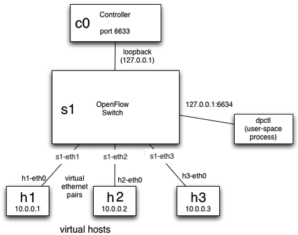

## Introduction
---

SDN is a new approach to the current world of networking, in this lab you will learn basic concepts of SDN through OpenFlow. OpenFlow started with several engineers from Stanford University creating a protocol that would have a logically centralised control plane separated from the underlying switching details. OpenFlow was architected for a number of devices containing only data planes to respond to commands sent to them from a logically centralised controller that housed the single control plane for that network. The controller is responsible for maintaining all of the network paths, as well as programming each of the network devices it controlled. The commands and responses to those commands are described in the OpenFlow protocol.

## Background reading
---

Before starting this lab, read up on the technologies you will be using:

1. Get familiar with the SDN emulation environment, [Mininet](http://mininet.org/walkthrough/). (30 minutes – 1 hour)
2. Refresh your Python programming skills using the [Python Tutorial](http://docs.python.org/tutorial/). (1+ hour )
3. Study the [RYU Controller Tutorial](attachments/RYU-Controller-Tutorial.pdf). (~ 2 hours)
      *   [Pseudo-code.pdf](attachments/Pseudo-code.pdf)
      *   [Useful-mininet-setups.pdf](attachments/Useful-mininet-setups.pdf)
      *    **Note that sdnhub.org is not operable. All these documents have been fetched from web archive.**

## Laboratory environment
---

In this lab, you will start by learning the basics of running Mininet in a VirtualBox virtual machine. Mininet facilitates creating and manipulating Software Defined Networking components.

Through Mininet you will explore OpenFlow, which is an open interface for controlling the network elements through their forwarding tables. A network element may be converted into a switch, router or even an access points via low-level primitives defined in OpenFlow. This lab is your opportunity to gain hands-on experience with the platforms and debugging tools most useful for developing network control applications on OpenFlow.

To configure and install your own copy of the VirtualBox appliance (virtual machine) follow [these instructions](attachments/import-ova.pdf).

<!--

If you have troubles with ssh to guest VM from host machine, the following can help:

   1 Add host-only network. In =File Menu->Preferences->Network= click on the "Host-only Networks" tab and than add a new host-only network (with default settings) by clicking on the =+= icon (you may already have a network called =vboxnet0=, in such a case you can skip this step).
   1 Select your VM and go to the Settings tab. Go to Network->Adapter 1. Select the "Enable Adapter" box and attach it to "Host-only network" created at the step 1.

-->

Once imported, the user name is =nwen302= with a password of =nwen302=.

Important directories include:

```bash
/usr/local/lib/python2.7/dist-packages/ryu                                                 
                                          /app     
                                          /base
                                          /....
                                          /controller
                                          /lib
                                          /ofproto
                                          /....
                                          /topology
```

`app` : A set of applications that run on-top of the controller.

`base` : Contains the base class for RYU applications. The RyuApp class in the app_manager.py file is inherited when creating a new application.

`controller` : The required set of files to handle OpenFlow functions (e.g., packets from switches, generating flows, handling network events, gathering statistics etc).

`lib` : Packet libraries to parse different protocol headers and a library for OFConfig. In addition, it includes parsers for Netflow and sFlow too.

`ofproto` : OpenFlow protocol specific information and related parsers to support different versions of OF protocol (1.0, 1.2, 1.3, 1.4)

`topology` : Code that performs topology discovery related to OpenFlow switches and handles associated information (e.g., ports, links etc). Internally uses LLDP protocol.

### Network topology
---

The topology has three hosts named h1, h2 and h3 respectively. Each host has an Ethernet interface called h1-eth0, h2-eth0 and h3-eth0 respectively. The three hosts are connected through a switch named s1.

The switch s1 has three ports named s1-eth1, s1-eth2 and s1-eth3. The controller is connected on the loopback interface (in real life this may or may not be the case, it means the switch and controller are built in a single box).

The controller is identified as c0 and connected through port 6653.



### Creating a test emulated network
---

**Before we start, please note the following:**

   : **$** preceeds Linux commands that should be typed at the shell prompt (as user nwen302),
   : **mininet>** preceeds Mininet commands that should be typed at Mininet’s CLI,
   : **#** preceeds Linux commands that are typed at a root shell prompt.

1. In the Virtual Machine, create the network with the following command:

```bash
$ sudo mn --topo=single,3 --mac
```

Note that since we are not providing here an external controller, mininet will create its own.

2. To verify that the network was successfully created, within the mininet prompt:

```bash
mininet> net
mininet> dump
```

You should be able to determine from the output if the network is indeed as in the topology diagram as shown above.

#### Accessing each host
---

1. To check the network interfaces on h1

```bash
mininet> h1 ifconfig
```

2. To ping another host from h1

```bash
mininet> h1 ping h3
mininet> h2 ping h1
```

3. To ping all hosts from all hosts

```bash
mininet> pingall
```

#### Housekeeping in mininet
---

To exit and clear devices

```bash
mininet> exit
$ sudo mn -c
```

### Creating the emulated network for the Lab - Connecting to Ryu Controller
---

To ensure that no other controller is present:

//<!--
//<verbatim>
//$ sudo killall controller
//</verbatim>
//
//Note that this controller is a simple OpenFlow reference controller implementation in linux.
//-->

In a new terminal session, start the Ryu controller:

```bash
$ sudo ryu run /usr/local/lib/python2.7/dist-packages/ryu/app/simple_switch_13.py
```

Alternatively, you can also start the controller using ryu-manager:

```bash
$ sudo ryu-manager /usr/local/lib/python2.7/dist-packages/ryu/app/simple_switch_13.py
```

To get more detailed notifications about the controller stat you can add the =--verbose= option:

```bash
$ sudo ryu run /usr/local/lib/python2.7/dist-packages/ryu/app/simple_switch_13.py --verbose
```

Clear all mininet components

```bash
$ sudo mn -c
```

Start mininet with remote controller:

```bash
$ sudo mn --controller=remote --topo=single,3 --switch=ovsk,protocols=OpenFlow13 --mac
```

With the optional argument =--controller=remote=, it defaults to =localhost:6653=. By the option =--switch=ovsk,protocols=OpenFlow13= we tell Mininet to use OpenFlow version 1.3. =--mac= will tell Mininet to create hosts with easily readable MAC addresses.

---+++ All about flows
---

A flow is the finest grained work unit of a switch.

In your VM emulated network environment there is a number of utilities enabling visibility into the network, its hosts, network devices and their flow tables. They can be especially useful for debugging by viewing flow state and flow counters. 

Assuming you have already created an emulated network and connected it to a Ryu controller (as showed in previous section), in a separate terminal window (e.g. using =screen= or another =ssh= session) you can run the following commands.

To print a brief overview of the database contents (information about all the virtual switches):

<verbatim>
$ sudo ovs-vsctl show
</verbatim>

To see more options for command =ovs-vsctl=:

<verbatim>
$ man ovs-vsctl
</verbatim>

To print to the console information on =switch number 1=, including information on its flow tables and ports:

<verbatim>
$ sudo ovs-ofctl -O OpenFlow13 show s1
</verbatim>

To prints to the console statistics for network devices associated with =switch number 1=:

<verbatim>
$ sudo ovs-ofctl -O OpenFlow13 dump-ports s1
</verbatim>

To print to the console all flow entries in tables of =switch number 1=:

<verbatim>
$ sudo ovs-ofctl -O OpenFlow13 dump-flows s1
</verbatim>

To see more options for command =ovs-ofctl=:

<verbatim>
$ man ovs-ofctl
</verbatim>

---+++ Developing RYU applications

Ryu is written fully in python script. To develop your own aplication you can start with opening related files in the =.../ryu/app= folder with your favorite editor (which is vi) and edit them. Do not forget to restart ryu after making any changes.

To get some ideas about developing applications you can start with [[http://ryu.readthedocs.io/en/latest/writing_ryu_app.html][this tutorial]].

---++++ Packets with the RYU packet library

Ryu also includes [[http://ryu.readthedocs.io/en/latest/library_packet.html][packet parser library]] <u>which may come in handy when working on the TASKS</u>.

---+++ The simple_switch_13.py file

The *simple_switch_13.py* file is located in your virtual machine in the following folder:

<verbatim>
/usr/local/lib/python2.7/dist-packages/ryu/app
</verbatim>

Assuming you want to edit this file using your favorite text editor (definitely vi), you would enter

<verbatim>
$ sudo vi /usr/local/lib/python2.7/dist-packages/ryu/app/simple_switch_13.py
</verbatim>

Alternatively, you can also make a copy of this file to your home directory and link this copy to the controller

<verbatim>
$ cd
$ cp /usr/local/lib/python2.7/dist-packages/ryu/app/simple_switch_13.py ~/sw.py
$ sudo ryu-manager sw.py
</verbatim>

%RED% Keep track of which copy of the *simple_switch_13.py* you are editing since this is one of the files you will have to hand in. %ENDCOLOR%

*NOTE* 

All the files in the =ryu= folder are created by the =root= user. When you make a copy with =sudo=, the owner will remain the =root= user. In this case, the copy cannot be edited by the user =nwen302=. It is better to change the file owner with the following command:

<verbatim>$sudo chown nwen302:nwen302 sw.py</verbatim>

But keep in mind that you will still need to run Ryu and Mininet using sudo.

---+++ Understanding simple_switch_13.py

The simple switch keeps track of where the host with each MAC address is located and accordingly sends packets towards the destination and not flood all ports.

Packet logic:

<verbatim>
Create a table called mac_to_port;
if { packet_in to switch }  {    
    Parse packet to reveal src and dst MAC addr;
    Store in the dictionary the mapping between 
        src_mac and the in_port;
    Lookup dst_mac in mac_to_port dict of switch 
        s1 to find next hop;
    if { next hop is found } { 
        create flow_mod;
        send;
     } else { 
         flood all ports != in_port;
    }
}</verbatim>

This logic might be familiar for you from [[https://ecs.victoria.ac.nz/Courses/NWEN302_2017T2/Lab2#Part_40b_41_45_Learning_Switch][Lab 2 Part B]]. Similarly as in that Lab, here you are also going to work with a *learning switch*. 

A more detailed description of the <b>simple_switch_13.py</b> file can be found in the [[https://osrg.github.io/ryu-book/en/Ryubook.pdf][RYU SDN FRAMEWORK for OpenFlow 1.3]], in *Chapter 4*. 

---++ Requirements

---+++ Key Task 1

Modify =simple_switch_13.py= to include logic to block traffic between host 2 and host 3.

---+++ Key Task 2

Extend =simple_switch_13.py= to count all traffic going to and originating from host 1.

---+++ Key Task 3

Extend =simple_switch_13.py= to combine Task 1 and Task 2 functionalities. Keep track of all traffic (count the number of packets) originating from each host. If the counter exceeds a specific number, block all the traffic originating from this host for 24 hours. The maximum packet count number should be configured through =MAX_COUNT= variable.

<!--
Create a rule in =simple_switch_13.py= that routes messages to the controller for topology maintenance.

*HINT*: Ryu’s topology viewer uses [[http://en.wikipedia.org/wiki/Link_Layer_Discovery_Protocol][LLDP]] to visualize routes, you will need to create a simple database application to maintain routes and then trap LLDP messages to update the database. You may assume a single database and do not need to address any concurrency issues.

Please see the attachment "Topology_Discovery_with_Ryu.pdf" for more information.

-->


---++ What to hand in

   * All relevant code. i.e. the modified *simple_switch_13.py* (if you haven't changed its name) and whatever new Python files you've created.
      * If you have "borrowed" code from on-line resources and/or other sources, say so in your code comments.
   * A report (max 2,000 words, pictures are always good) describing your development process.
      * State which of the three tasks listed above you believe you have successfully implemented.
      * Reflect on what you found easy, what caused you problems and how you overcame those issues.
      * If you believe you have a particularly sophisticated or original implementation, state why you think this is the case.
      * Carefully document all investigatory steps taken. If you found several ways to do something, stare why you chose the one you used.
      * Take care to document all testing steps take.

---++ Grading scheme

The following three aspects will be assessed:

   1 (60%) *Does it work?*
      * Task 1 (20%)
      * Task 2 (20%)
      * Task 3 (20%)
   1 (10%) *Is the code well written?*
      * Marks awarded for:
         * Clarity - Is it obvious where your changes are? Are they well commented?
         * Modularity - Remember Pythons ability to include and extend existing classes.
         * Giving credit to on-line resources you “borrowed" code segments from (if any).
         * Evidence of original work (i.e. not simply having copied exisiting code).
      * Marks deducted for:
         * Not giving credit to on-line resources you “borrowed" code segments from.
   1 (30%) *Did you understand what you were doing?*
      * The code partially show this, but the report is where you convince me.
      * Marks awarded for:
         * Clearly stating which tasks were achieved and which were not (and why).
         * Detail on how each task was tackled, what alternatives were considered and why a particular solution was chosen.
         * Description of development process.
         * Details of testing methodology - VERY IMPORTANT, provide lots of detail here, this is where the marks are!
         * Observations of what was easy, what was hard, where problems arose, how they were overcome.
         * Reflection of how you might improve or extend your solution.
